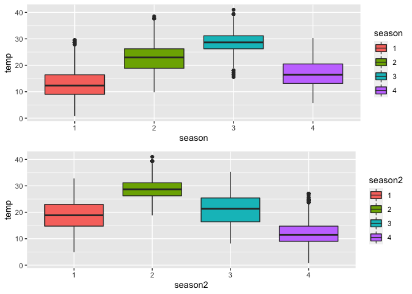
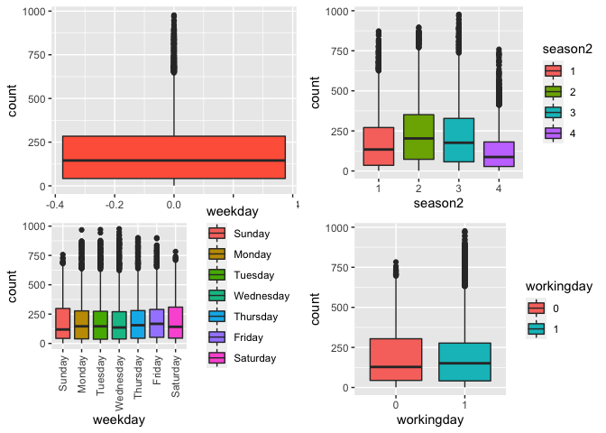
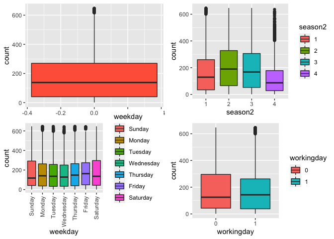
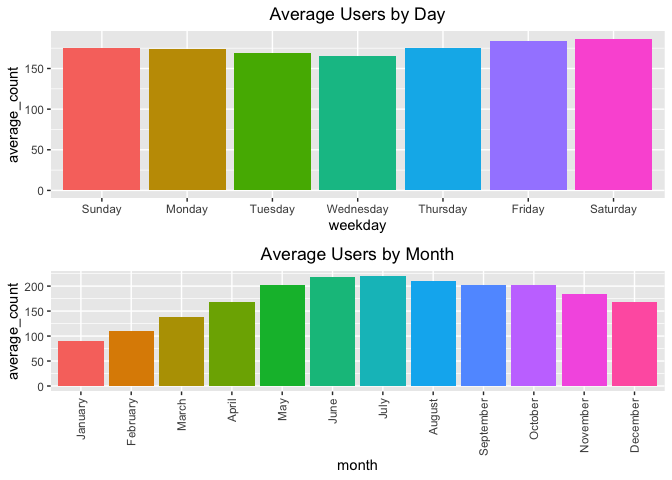
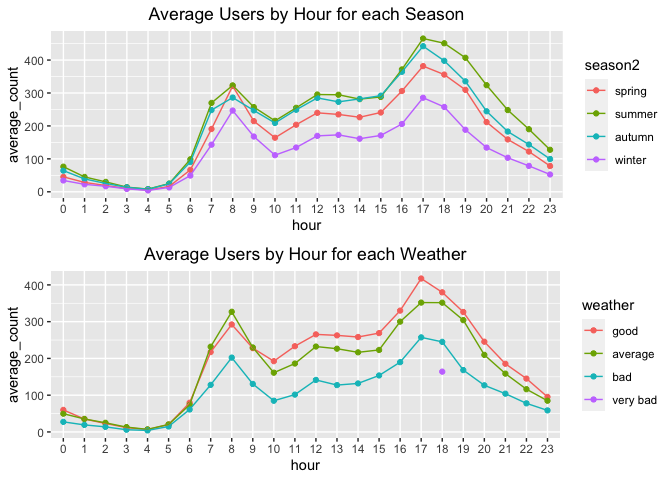
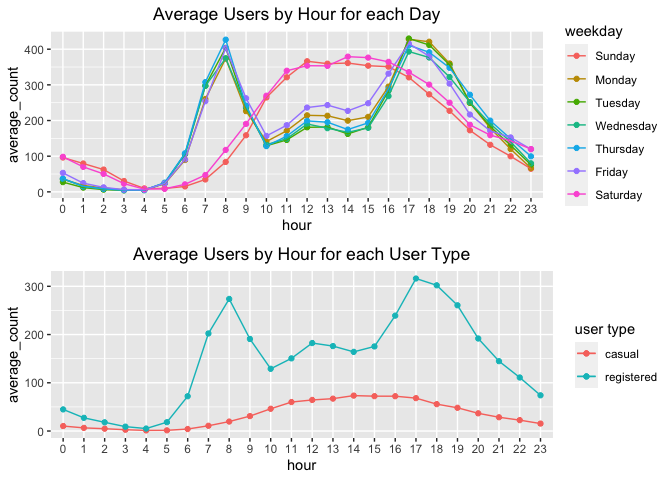
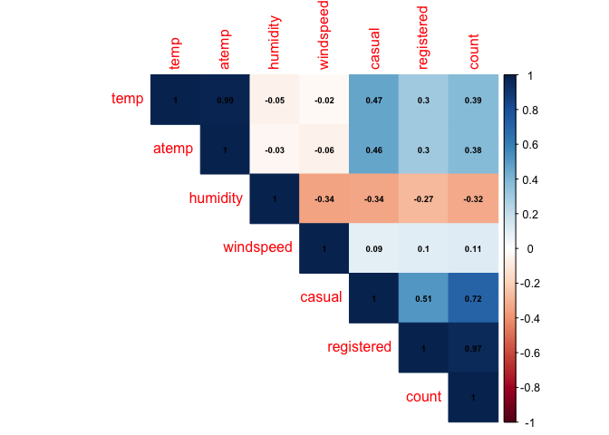
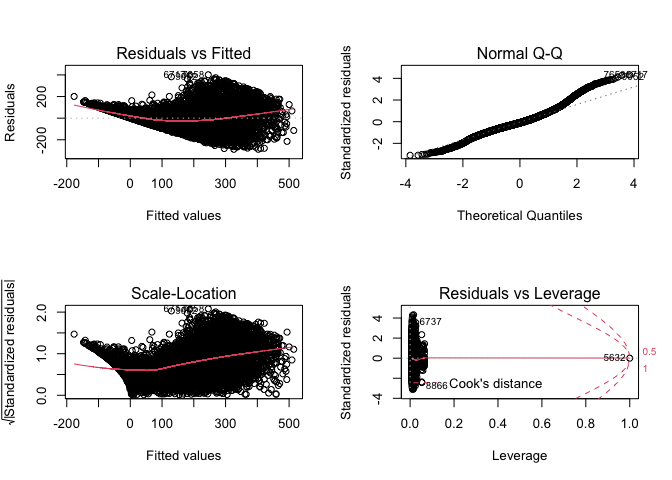
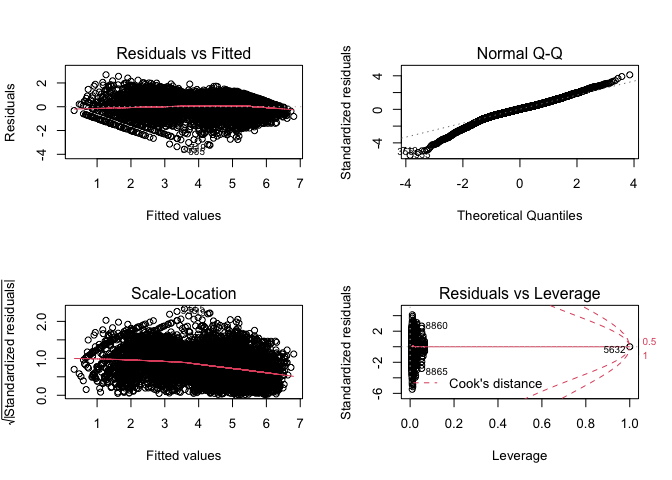
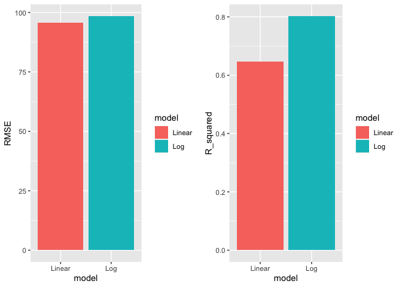

Synopsis
--------

Bike sharing systems are a means of renting bicycles where the process
of obtaining membership, rental, and bike return is automated via a
network of kiosk locations throughout a city. Using these systems,
people are able rent a bike from a one location and return it to a
different place on an as-needed basis. Currently, there are over 500
bike-sharing programs around the world. In this project, we will use
linear regression and a log transformation to predict bike sharing
demand.

Data
----

The data is taken from
[Kaggle](https://www.kaggle.com/c/bike-sharing-demand/overview). It
contains the two-year historical log corresponding to years 2011 and
2012 from Capital Bikeshare system, Washington D.C., USA. Details of its
columns are as follows:

<table>
<colgroup>
<col style="width: 4%" />
<col style="width: 95%" />
</colgroup>
<thead>
<tr class="header">
<th>Variable</th>
<th>Description</th>
</tr>
</thead>
<tbody>
<tr class="odd">
<td>datetime</td>
<td>hourly date + timestamp</td>
</tr>
<tr class="even">
<td>season</td>
<td>1 = spring, 2 = summer, 3 = fall, 4 = winter</td>
</tr>
<tr class="odd">
<td>holiday</td>
<td>whether the day is considered a holiday</td>
</tr>
<tr class="even">
<td>workingday</td>
<td>whether the day is neither a weekend nor holiday</td>
</tr>
<tr class="odd">
<td>weather</td>
<td>1: Clear, Few clouds, Partly cloudy, Partly cloudy 2: Mist + Cloudy, Mist + Broken clouds, Mist + Few clouds, Mist 3: Light Snow, Light Rain + Thunderstorm + Scattered clouds, Light Rain + Scattered clouds 4: Heavy Rain + Ice Pallets + Thunderstorm + Mist, Snow + Fog</td>
</tr>
<tr class="even">
<td>temp</td>
<td>temperature in Celsius</td>
</tr>
<tr class="odd">
<td>atemp</td>
<td>“feels like” temperature in Celsius</td>
</tr>
<tr class="even">
<td>humidity</td>
<td>relative humidity</td>
</tr>
<tr class="odd">
<td>windspeed</td>
<td>wind speed</td>
</tr>
<tr class="even">
<td>casual</td>
<td>number of non-registered user rentals initiated</td>
</tr>
<tr class="odd">
<td>registered</td>
<td>number of registered user rentals initiated</td>
</tr>
<tr class="even">
<td>count</td>
<td>number of total rentals</td>
</tr>
</tbody>
</table>

Loading in the Data
-------------------

Load in required libraries.

    library(lubridate)
    library(xts)
    library(ggplot2)
    library(gridExtra)
    library(corrplot)
    library(caret)
    library(MASS)
    library(dplyr)
    library(Metrics)

Check its head and structure.

    rental <- read.csv("train.csv")
    head(rental)

    ##              datetime season holiday workingday weather temp  atemp humidity
    ## 1 2011-01-01 00:00:00      1       0          0       1 9.84 14.395       81
    ## 2 2011-01-01 01:00:00      1       0          0       1 9.02 13.635       80
    ## 3 2011-01-01 02:00:00      1       0          0       1 9.02 13.635       80
    ## 4 2011-01-01 03:00:00      1       0          0       1 9.84 14.395       75
    ## 5 2011-01-01 04:00:00      1       0          0       1 9.84 14.395       75
    ## 6 2011-01-01 05:00:00      1       0          0       2 9.84 12.880       75
    ##   windspeed casual registered count
    ## 1    0.0000      3         13    16
    ## 2    0.0000      8         32    40
    ## 3    0.0000      5         27    32
    ## 4    0.0000      3         10    13
    ## 5    0.0000      0          1     1
    ## 6    6.0032      0          1     1

    str(rental)

    ## 'data.frame':    10886 obs. of  12 variables:
    ##  $ datetime  : chr  "2011-01-01 00:00:00" "2011-01-01 01:00:00" "2011-01-01 02:00:00" "2011-01-01 03:00:00" ...
    ##  $ season    : int  1 1 1 1 1 1 1 1 1 1 ...
    ##  $ holiday   : int  0 0 0 0 0 0 0 0 0 0 ...
    ##  $ workingday: int  0 0 0 0 0 0 0 0 0 0 ...
    ##  $ weather   : int  1 1 1 1 1 2 1 1 1 1 ...
    ##  $ temp      : num  9.84 9.02 9.02 9.84 9.84 ...
    ##  $ atemp     : num  14.4 13.6 13.6 14.4 14.4 ...
    ##  $ humidity  : int  81 80 80 75 75 75 80 86 75 76 ...
    ##  $ windspeed : num  0 0 0 0 0 ...
    ##  $ casual    : int  3 8 5 3 0 0 2 1 1 8 ...
    ##  $ registered: int  13 32 27 10 1 1 0 2 7 6 ...
    ##  $ count     : int  16 40 32 13 1 1 2 3 8 14 ...

Data Cleaning
-------------

Convert the following columns to categorical.

    rental$season <- factor(rental$season)
    rental$holiday <- factor(rental$holiday)
    rental$workingday <- factor(rental$workingday)
    rental$weather <- factor(rental$weather)

Note that there are multiple rows with `windspeed` value of 0.

    length(rental$windspeed[rental$windspeed == 0])

    ## [1] 1313

Replace ‘0’ values with previous known value, as wind speed at a point
in time is dependent on the wind speed an hour ago. Since the first few
rows have ‘0’ wind speed and no reference point, we replace them with
the next known value.

    is.na(rental$windspeed) <- rental$windspeed == 0
    rental$windspeed <- na.locf(rental$windspeed, na.rm=FALSE)
    # Replace first few '0' values with next known value
    rental$windspeed <- na.locf(rental$windspeed, fromLast = TRUE, na.rm=FALSE)

Feature Engineering
-------------------

Create multiple columns from `datetime` column, including another season
column created from the months. Convert the columns to categorical and
drop the `datetime` column.

    rental$datetime <- ymd_hms(rental$datetime)
    rental$week <- factor(week(rental$datetime))
    rental$hour <- factor(hour(rental$datetime))
    rental$day <- factor(day(rental$datetime))
    rental$weekday <- factor(weekdays(rental$date), levels= c("Sunday", "Monday", "Tuesday", "Wednesday", "Thursday", "Friday", "Saturday"))
    rental$month <- month(rental$datetime)
    rental$season2 <- ifelse((rental$month <=5) & (rental$month >=3), 1, 
                            ifelse((rental$month <=8) & (rental$month >=6), 2,
                                    ifelse((rental$month <=11) & (rental$month >=9), 3, 4)))
    rental$month <- factor(rental$month)
    rental$season2 <- factor(rental$season2)
    rental <- subset(rental, select = -datetime)

When we compare the temperatures for `season` and `season2`, we realise
that `season` has higher temperatures in autumn than summer, which does
not seem accurate. Thus, we are going to use `season2` instead of
`season`.

    box1 <- rental %>% group_by(season) %>% select(temp) %>% ggplot(aes(x=season,y=temp,fill=season)) + geom_boxplot()
    box2 <- rental %>% group_by(season2) %>% select(temp) %>% ggplot(aes(x=season2,y=temp,fill=season2)) + geom_boxplot()
    grid.arrange(box1, box2, nrow=2)

Drop the `season` column.

    rental <- subset(rental, select = -season)

Exploratory Data Analysis
-------------------------

### Removing Outliers

Use boxplots to check for outliers.

    box3 <- ggplot(rental, aes(y=count)) + geom_boxplot(fill='tomato')
    box4 <- ggplot(rental, aes(x=season2, y=count, fill=season2)) + geom_boxplot()
    box5 <- ggplot(rental, aes(x=weekday, y=count, fill=weekday)) + geom_boxplot() + theme(axis.text.x = element_text(angle = 90, vjust = 0.5, hjust=1))
    box6 <- ggplot(rental, aes(x=workingday, y=count, fill=workingday)) + geom_boxplot()
    grid.arrange(box3, box4, box5, box6, ncol=2)

Based on the boxplot rule, there appears to be multiple outliers. We
remove the outliers as follows:

    upperLimit <- quantile(rental$count, 0.75) + 1.5 * IQR(rental$count)
    rentalOut <- rental %>% filter(count <= upperLimit)

Check the boxplots again and note that there are fewer outliers left.

    box3 <- ggplot(rentalOut, aes(y=count)) + geom_boxplot(fill='tomato')
    box4 <- ggplot(rentalOut, aes(x=season2, y=count, fill=season2)) + geom_boxplot()
    box5 <- ggplot(rentalOut, aes(x=weekday, y=count, fill=weekday)) + geom_boxplot() + theme(axis.text.x = element_text(angle = 90, vjust = 0.5, hjust=1))
    box6 <- ggplot(rentalOut, aes(x=workingday, y=count, fill=workingday)) + geom_boxplot()
    grid.arrange(box3, box4, box5, box6, ncol=2)

### Average Count over Time

    bar1_data <- rentalOut %>% group_by(weekday) %>% summarise(average_count=sum(count)/n())
    bar1 <- ggplot(bar1_data, aes(x=weekday, y=average_count, fill=weekday)) + 
            geom_bar(stat='identity') +
            ggtitle("Average Users by Day") +
            theme(plot.title = element_text(hjust = 0.5), legend.position = "none")

    bar2_data <- rentalOut %>% group_by(month) %>% summarise(average_count=sum(count)/n())
    bar2 <- ggplot(bar2_data, aes(x=month, y=average_count, fill=month)) + 
            geom_bar(stat='identity') +
            scale_x_discrete(breaks=c("1","2","3","4","5","6","7","8","9","10","11","12"),  
                             labels=c("January","February","March","April","May","June","July",
                                       "August","September","October","November","December")) +
            theme(axis.text.x = element_text(angle = 90, vjust = 0.5, hjust=1)) +
            ggtitle("Average Users by Month") +
            theme(plot.title = element_text(hjust = 0.5), legend.position = "none")
    grid.arrange(bar1, bar2, nrow=2)

There appears to be more rental bike users on Friday and Saturday. There
are also more users during the summer months, from May to August.

    line1_data <- rentalOut %>% group_by(hour,season2) %>% summarise(average_count=sum(count)/n())
    line1 <- ggplot(line1_data, aes(x=hour, y=average_count, group=season2, color=season2)) + 
             geom_point() + 
             geom_line() +
             scale_color_discrete(labels = c("spring", "summer", "autumn","winter")) +
             ggtitle("Average Users by Hour for each Season") +
             theme(plot.title = element_text(hjust = 0.5))

    line2_data <- rentalOut %>% group_by(hour,weather) %>% summarise(average_count=sum(count)/n())
    line2 <- ggplot(line2_data, aes(x=hour, y=average_count, group=weather, color=weather)) + 
        geom_point() + 
        geom_line() +
        scale_color_discrete(labels = c("good", "average", "bad","very bad")) +
        ggtitle("Average Users by Hour for each Weather") +
        theme(plot.title = element_text(hjust = 0.5))
    grid.arrange(line1, line2, nrow=2)

There are more users during the summer and less users during the winter.
The most frequent bike rental timings are at 8am and 5pm, possibly due
to working and schooling commuters who use a bike to travel. As
expected, there are more users during good weather and less users during
bad weather.

    line3_data <- rentalOut %>% group_by(hour, weekday) %>% summarise(average_count=sum(count)/n())
    line3 <- ggplot(line3_data, aes(x=hour, y=average_count, group=weekday, color=weekday)) + 
             geom_point() + 
             geom_line() +
             ggtitle("Average Users by Hour for each Day") +
             theme(plot.title = element_text(hjust = 0.5))

    line4_data <- rentalOut %>% group_by(hour) %>% summarise(casual=sum(casual)/n(), registered=sum(registered)/n()) 
    line4 <- ggplot(line4_data, aes(x=hour, group=1)) + 
             geom_point(aes(y=casual, color="casual")) + 
             geom_line(aes(y=casual, color="casual")) + 
             geom_point(aes(y=registered, color="registered")) + 
             geom_line(aes(y=registered, color="registered")) +
             ylab("average_count") + 
             labs(color = 'user type') +
             ggtitle("Average Users by Hour for each User Type") +
             theme(plot.title = element_text(hjust = 0.5))

    grid.arrange(line3, line4, nrow=2)

The bike rental counts are similar during the weekdays but different
during the weekends. On the non-working days (weekends), the peak bike
rental timing is from 11am to 4pm, which is different from the peak
timings of 8am and 5pm on working days. As mentioned earlier, this is
most likely due to working and schooling commuters during the weekdays
and them not having to travel to work or school on the weekends.

Based on the user type, we can tell that most of the working and
schooling commuters are registered users as the graphs seem similar.

### Correlation Analysis

Plot a correlation plot to check the correlation betweeen continuous
variables.

    colPlot <- rentalOut %>% select(temp, atemp, humidity, windspeed, casual, registered, count)
    corrplot(cor(colPlot), type="upper", method="color",addCoef.col = "black",number.cex = 0.6)

Notice that `temp` and `atemp` are very correlated so we should not
include `atemp` in the model. The column `count` is also dependent on
`registered` and `casual` so we should not remove these columns as well.

Data Splitting
--------------

Remove the unnecessary columns, including `holiday` since `workingday`
is related to it.

    rentalKeep <- subset(rentalOut, select = -c(atemp,registered,casual,holiday))
    str(rentalKeep)

    ## 'data.frame':    10586 obs. of  12 variables:
    ##  $ workingday: Factor w/ 2 levels "0","1": 1 1 1 1 1 1 1 1 1 1 ...
    ##  $ weather   : Factor w/ 4 levels "1","2","3","4": 1 1 1 1 1 2 1 1 1 1 ...
    ##  $ temp      : num  9.84 9.02 9.02 9.84 9.84 ...
    ##  $ humidity  : int  81 80 80 75 75 75 80 86 75 76 ...
    ##  $ windspeed : num  6 6 6 6 6 ...
    ##  $ count     : int  16 40 32 13 1 1 2 3 8 14 ...
    ##  $ week      : Factor w/ 45 levels "1","2","3","5",..: 1 1 1 1 1 1 1 1 1 1 ...
    ##  $ hour      : Factor w/ 24 levels "0","1","2","3",..: 1 2 3 4 5 6 7 8 9 10 ...
    ##  $ day       : Factor w/ 19 levels "1","2","3","4",..: 1 1 1 1 1 1 1 1 1 1 ...
    ##  $ weekday   : Factor w/ 7 levels "Sunday","Monday",..: 7 7 7 7 7 7 7 7 7 7 ...
    ##  $ month     : Factor w/ 12 levels "1","2","3","4",..: 1 1 1 1 1 1 1 1 1 1 ...
    ##  $ season2   : Factor w/ 4 levels "1","2","3","4": 4 4 4 4 4 4 4 4 4 4 ...

Split the data into training and test sets.

    set.seed(100)
    trainIndex <- createDataPartition(rentalKeep$count, p = 0.8, list=FALSE)
    rentalTrain <- rentalKeep[trainIndex,]
    rentalTest <- rentalKeep[-trainIndex,]

Modelling
---------

### Linear Regression

We will use linear regression to fit the variables into the data, which
uses the ordinary least squares approach to choose the best fit. For
variable selection, we will use stepwise regression. The purpose of this
algorithm is to add and remove potential candidates in the models and
keep those who have a significant impact on the dependent variable. We
have chosen the backwards direction so the model will remove
insignificant predictors one by one.

    fit <- lm(count~., data=rentalTrain)

    fit1 <- stepAIC(fit, direction="backward")

    ## Start:  AIC=76988.68
    ## count ~ workingday + weather + temp + humidity + windspeed + 
    ##     week + hour + day + weekday + month + season2
    ## 
    ## 
    ## Step:  AIC=76988.68
    ## count ~ workingday + weather + temp + humidity + windspeed + 
    ##     week + hour + day + weekday + month
    ## 
    ## 
    ## Step:  AIC=76988.68
    ## count ~ workingday + weather + temp + humidity + windspeed + 
    ##     week + hour + day + weekday
    ## 
    ##              Df Sum of Sq       RSS   AIC
    ## <none>                     73260336 76989
    ## - workingday  1     20559  73280894 76989
    ## - windspeed   1    192100  73452436 77009
    ## - day        18    640055  73900391 77026
    ## - weekday     6    778997  74039332 77066
    ## - humidity    1   1345901  74606237 77141
    ## - weather     3   1690492  74950827 77176
    ## - temp        1   3130678  76391014 77341
    ## - week       44   6379930  79640266 77608
    ## - hour       23  67862080 141122416 82496

Notice that we have removed the variables `season2` and `month` from the
model. Now, we use the model to predict the test set.

    ypred <- predict(fit1, rentalTest)

To evaluate the model, we will be using the Root Mean Squared Error
(RMSE) and R squared.

**Root Mean Squared Error (RMSE)** - Measure of the average deviation of
the estimates from the observed values.

**R squared** - Coefficient of determination, scaled between 0 and 1.
Measures the amount of variance of the response variable that can be
explained by the predictor variables.

    results1 <- data.frame(
            RMSE = rmse(rentalTest$count,ypred),
            R_squared = summary(fit1)$r.squared
    )
    results1

    ##       RMSE R_squared
    ## 1 95.76851 0.6457558

Let’s check its residual diagnostics to check if the model is a good
fit.

    par(mfrow=c(2,2))
    plot(fit1)

The residual vs fitted plot shows a curve, meaning that the residuals
are not evenly distributed around the center line. This indicates that
the model may not be a good fit. Let’s check the predictions for any
errors.

    summary(ypred)

    ##    Min. 1st Qu.  Median    Mean 3rd Qu.    Max. 
    ## -166.45   74.53  188.12  179.30  276.01  494.13

    summary(rentalTest$count)

    ##    Min. 1st Qu.  Median    Mean 3rd Qu.    Max. 
    ##     1.0    40.0   138.0   176.5   270.0   647.0

There appears to be negative values predicted for `count`, which does
not make sense.

### Log Transformation

Let’s try a log transformation. Perform a stepwise regression to check
which variables should be excluded. Compute its RMSE and R squared as
well.

    log_fit <- lm(log(count)~., data=rentalTrain)

    log_fit1 <- stepAIC(log_fit, direction="backward")

    ## Start:  AIC=-7029.9
    ## log(count) ~ workingday + weather + temp + humidity + windspeed + 
    ##     week + hour + day + weekday + month + season2
    ## 
    ## 
    ## Step:  AIC=-7029.9
    ## log(count) ~ workingday + weather + temp + humidity + windspeed + 
    ##     week + hour + day + weekday + month
    ## 
    ## 
    ## Step:  AIC=-7029.9
    ## log(count) ~ workingday + weather + temp + humidity + windspeed + 
    ##     week + hour + day + weekday
    ## 
    ##              Df Sum of Sq     RSS     AIC
    ## <none>                     3608.9 -7029.9
    ## - workingday  1       1.4  3610.3 -7028.6
    ## - windspeed   1      13.4  3622.2 -7000.6
    ## - day        18      35.6  3644.5 -6982.7
    ## - humidity    1      30.5  3639.4 -6960.6
    ## - weekday     6      66.3  3675.1 -6887.8
    ## - temp        1     123.7  3732.6 -6746.4
    ## - weather     3     141.9  3750.8 -6709.2
    ## - week       44     417.5  4026.3 -6190.7
    ## - hour       23    9211.0 12819.9  3661.9

    ypred <- exp(predict(log_fit1, rentalTest))

    results2 <- data.frame(
        RMSE = rmse(rentalTest$count,ypred),
        R_squared = summary(log_fit1)$r.squared
    )
    results2

    ##       RMSE R_squared
    ## 1 98.48844 0.8027965

Check its residual diagnostics to check if the model is a good fit.

    par(mfrow=c(2,2))
    plot(log_fit1)

The residual vs fitted plot now shows a horizontal line, meaning that
the residuals are evenly distributed around the center line. This
indicates that the model is a good fit. Let’s check the predictions
again.

    summary(ypred)

    ##    Min. 1st Qu.  Median    Mean 3rd Qu.    Max. 
    ##    1.29   45.22  136.88  163.22  254.10  776.13

    summary(rentalTest$count)

    ##    Min. 1st Qu.  Median    Mean 3rd Qu.    Max. 
    ##     1.0    40.0   138.0   176.5   270.0   647.0

This time the predictions are all positive and appear close to the
actual values.

Results
-------

Plot a barchart to visualise the results of both models.

    combined <- rbind(results1,results2)
    combined$model <- c("Linear", "Log")

    bar1 <- ggplot(combined, aes(x=model, y=RMSE, fill=model)) + geom_bar(stat="identity")
    bar2 <- ggplot(combined, aes(x=model, y=R_squared, fill=model)) + geom_bar(stat="identity")
    grid.arrange(bar1, bar2,ncol=2)

Although the log transformation model has a slightly higher RMSE than
the linear model, the R squared of the log transformation model is much
higher (0.80). This indicates that 80% of the variance of `count` can be
explained by the predictor variables, which makes it the better model.
